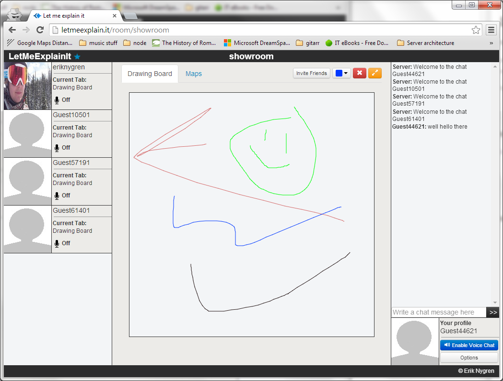

Let Me Explain It
=================

**What is it?**

A web HTML5 web conferencing application built for my final year university project

Available at: [http://letmeexplain.it](http://letmeexplain.it)

**Which allows users to:**

- Collaborate in real time through interactive tools
- Communicate via voice and chat

**Why?**

I did this project to:

- Experiment with HTML5
- Get experience with real time apps in browsers
- Attempt a native implementation without resources such as Flash and Java

**What is it built with?**

- AngularJS
- NodeJS + Express
- Websockets for conferencing data
- WebRTC using the [vLine](https://vline.com/ "vLine") library for voice data
- MySQL

## Installation Instructions ##

1. Get a copy of the repo
2. Import the database schema from *schema.sql* into your MySQL server
3. Set up the *config.js* file by following the *config_example.js* file
4. If you're configuring it to not run in debug mode, deploy the client side code using the Grunt task in the *angular_build* folder
5. Start the server by typing `node app.js` in the server folder

## Unit Testing ##

The unit test coverage is not amazing, but I'm working on it.

Currently all AngularJS controllers are fully tested, to run those tests, install *karma-cli* and install the dependencies in the *public/tests* folder using `npm install`.

Proceed to run the tests by typing `karma start` in the *public/tests* folder

For server side unit testing, mocha is used and the tests are ran through a grunt file. Install mocha and head into the *server/tests/* folder and type `Grunt` in your terminal/cmd to run these tests.

# ENJOY YOUR CONFERENCING!! #